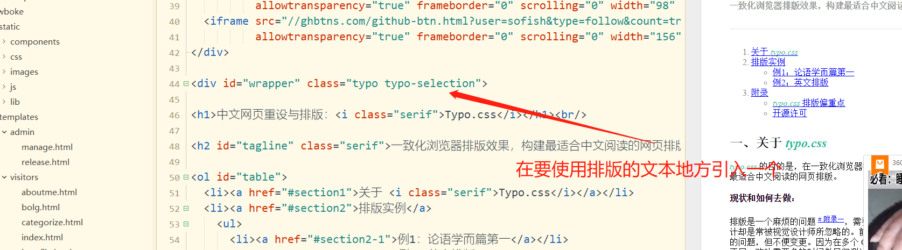
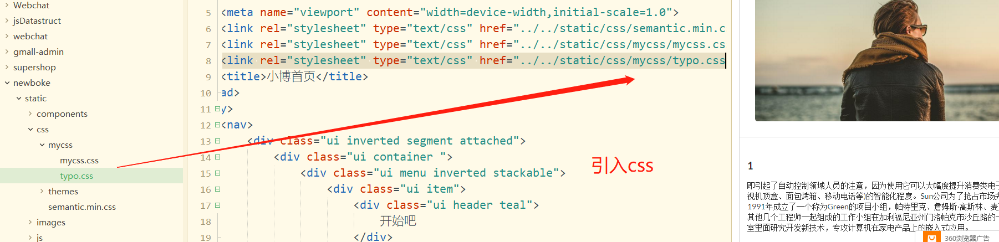
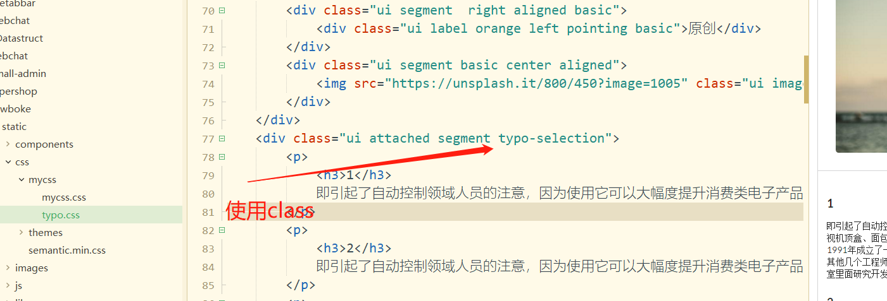
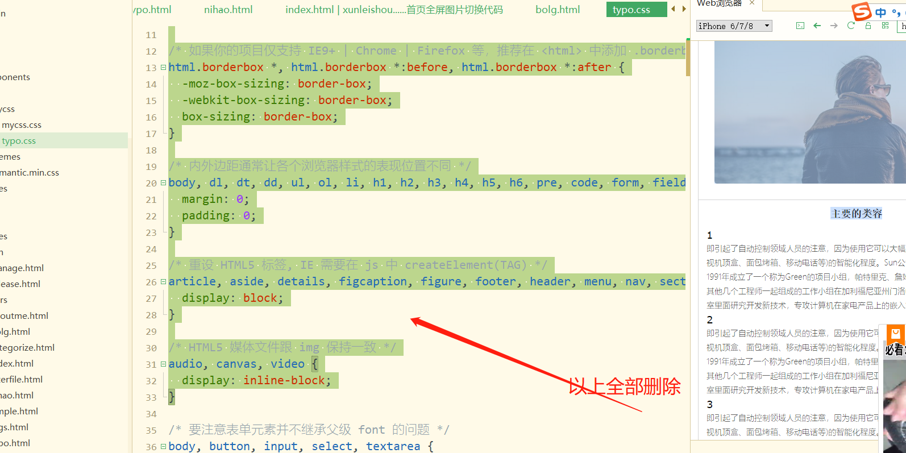
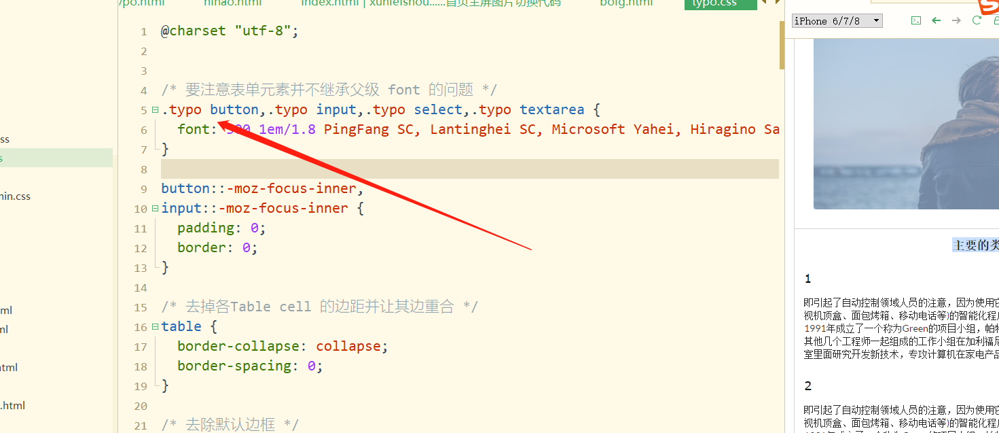
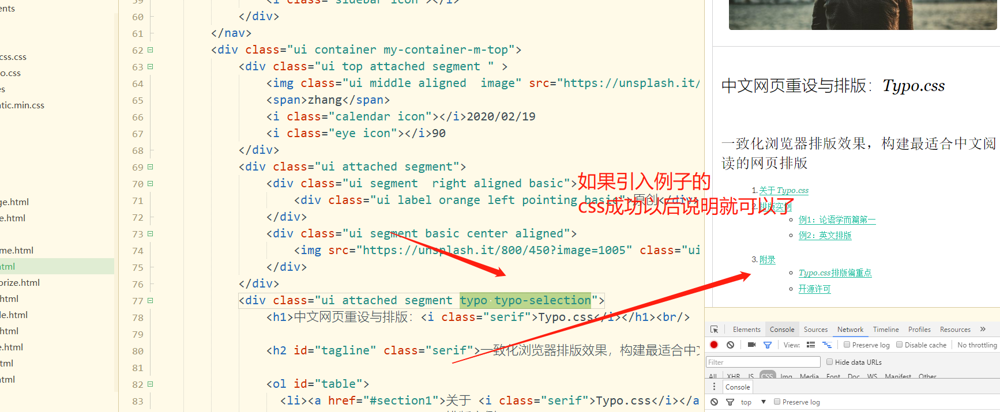

https://github.com/sofish/typo.css



```css
typo typo-selection
```





因为引入的时候topy和原来的ui有css冲突所以修改文件






把所有的class前都加上这个在笔记里面有一个修改完的了



测试是否成功用例子的中文排版的内容加到自己的项目中如果可以了就成功了

如果没有手机端的自适应可以使用semantic的UI table