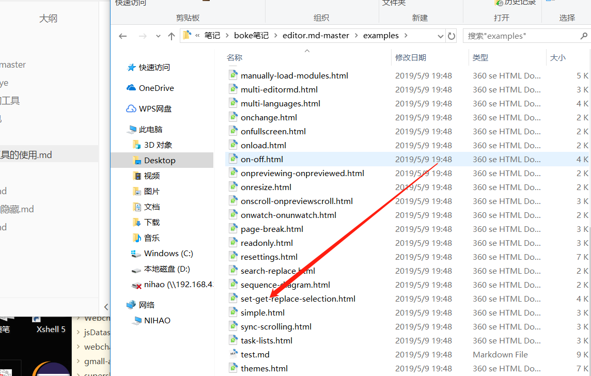
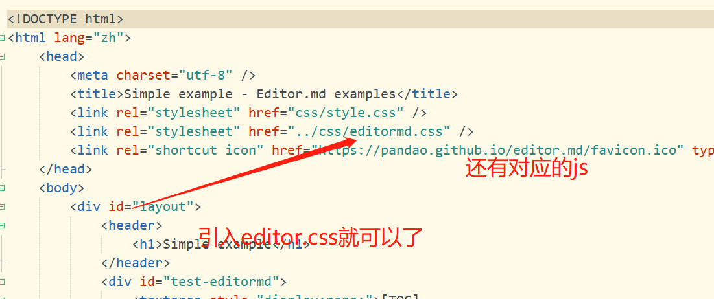
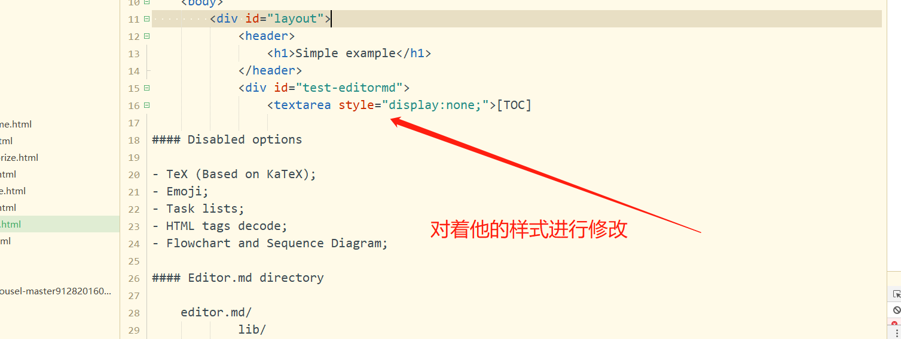
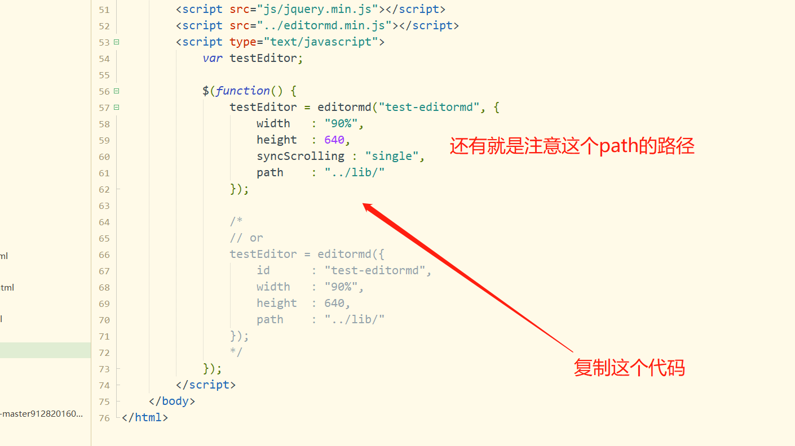
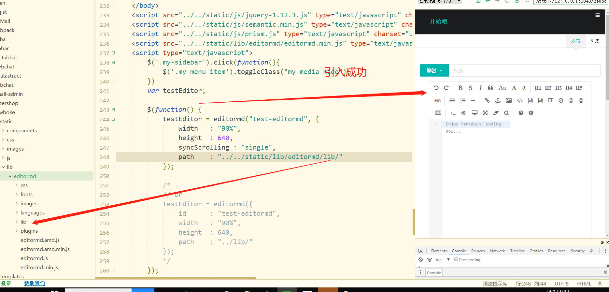
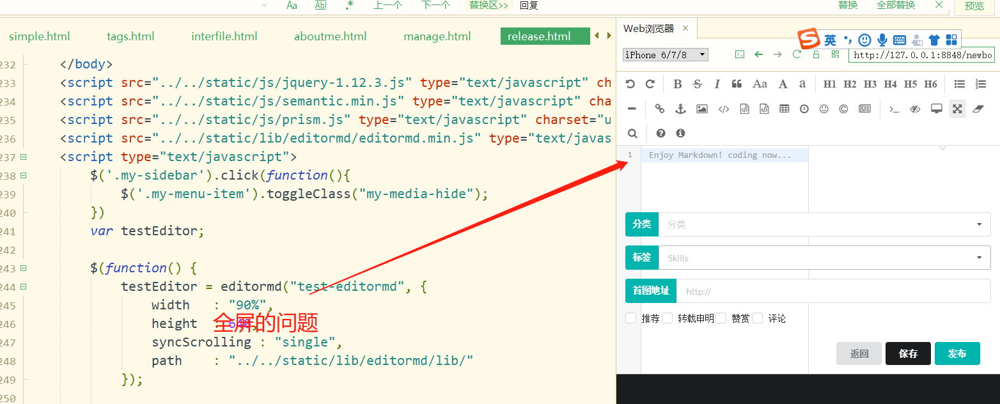
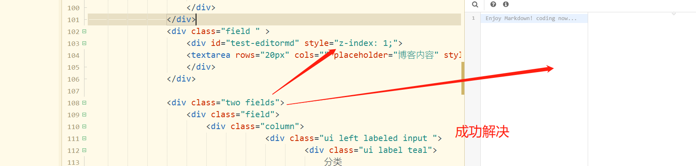

1先找到一个案例









```java
<div id="test-editormd">
                <textarea style="display:none;">[TOC]
```

```javascript
var testEditor;

            $(function() {
                testEditor = editormd("test-editormd", {
                    width   : "90%",
                    height  : 640,
                    syncScrolling : "single",
                    path    : "../lib/"
                });
                
                /*
                // or
                testEditor = editormd({
                    id      : "test-editormd",
                    width   : "90%",
                    height  : 640,
                    path    : "../lib/"
                });
                */
            });
```





