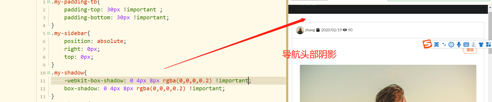
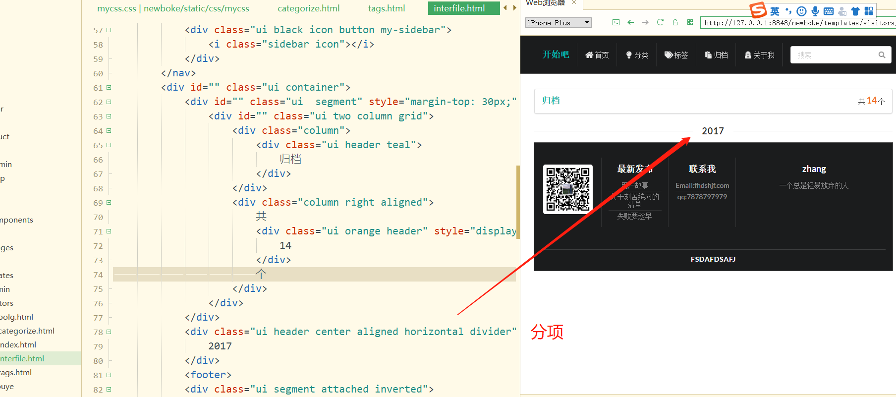
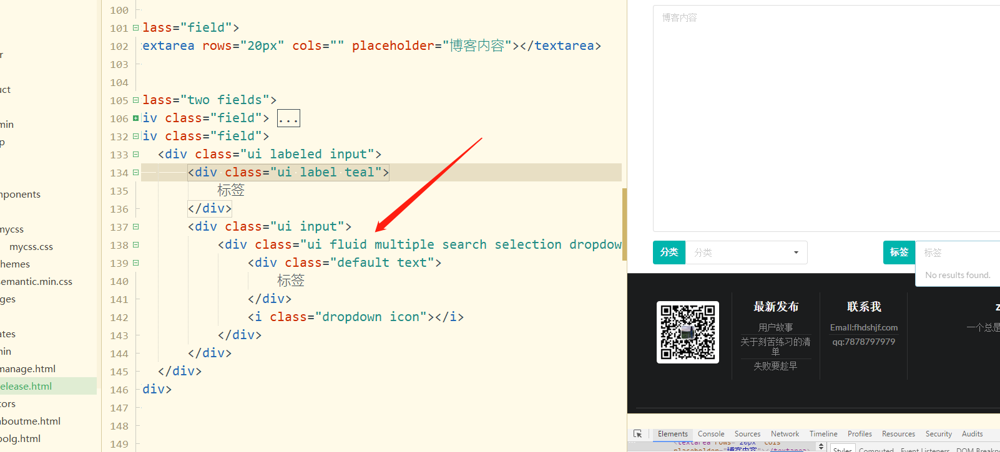

### 使用menu的时候如果超出了内容的宽度可以使用

ui vertical menu fluid   就是可以适应内容了

导航头部阴影




```java
.my-shadow{
	-webkit-box-shadow: 0 4px 8px rgba(0,0,0,0.2) !important;
	box-shadow: 0 4px 8px rgba(0,0,0,0.2) !important;
}

```



input可以直接的嵌套dropdown

