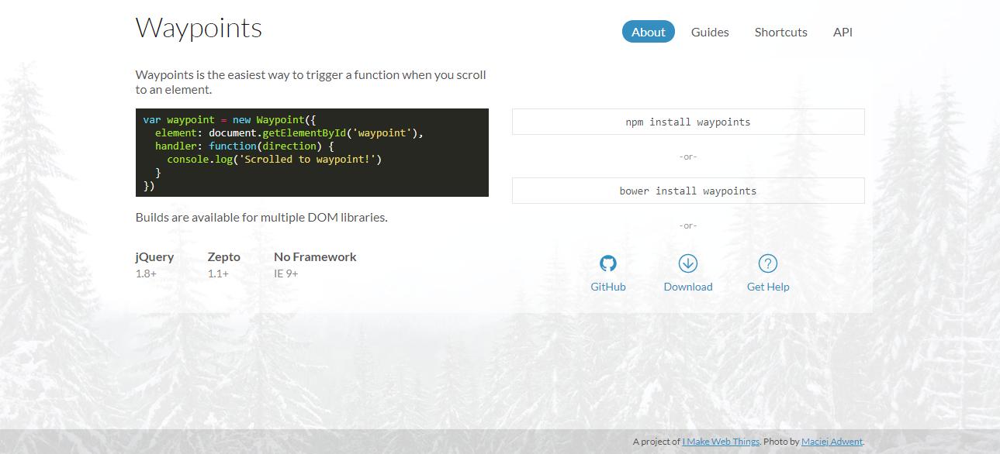
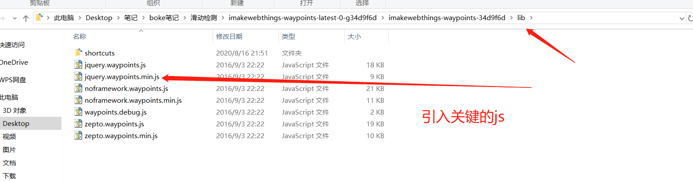
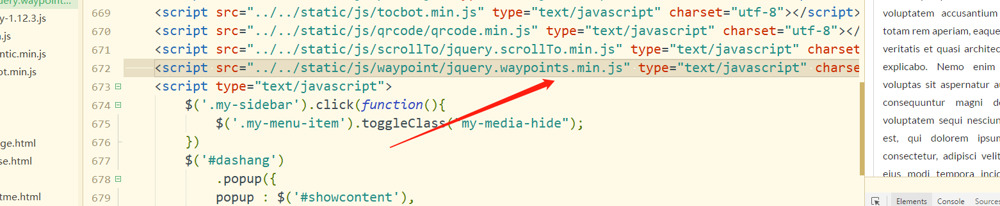
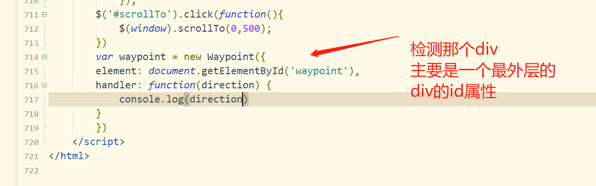
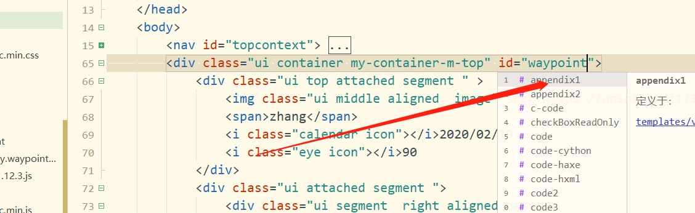

http://imakewebthings.com/waypoints/



```js
var waypoint = new Waypoint({
  element: document.getElementById('waypoint'),
  handler: function(direction) {
    console.log('Scrolled to waypoint!')
  }
})
```









```js
就是如果检测的元素状态发生改变，就可以用这个来修改其他的元素的动画
var waypoint = new Waypoint({
		element: document.getElementById('waypoint'),
		handler: function(direction) {
			if(direction=="down"){
				$('#iconbtns').show();
			}else if(direction=="up"){
				$('#iconbtns').hide(500)
			}
		}
		})
```

