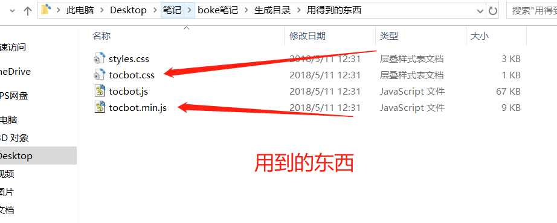
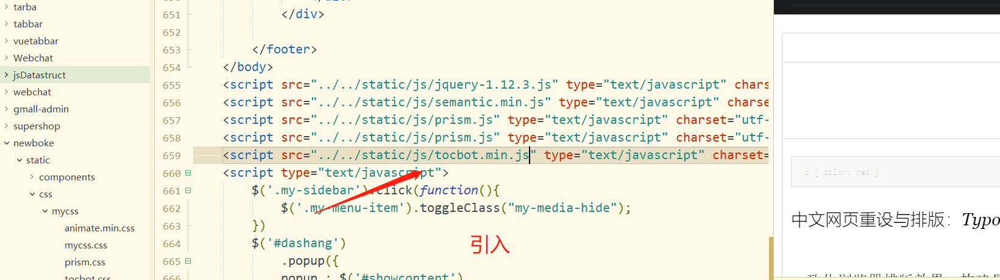
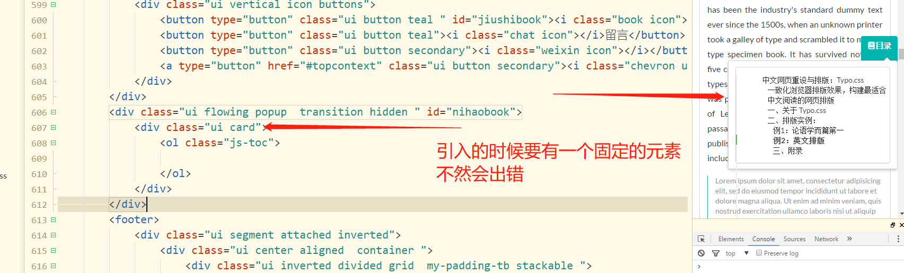
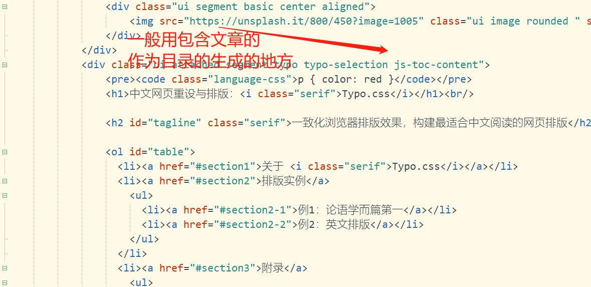

https://tscanlin.github.io/tocbot/#examples



使用之前要初始化



```css
tocbot.init({
  // Where to render the table of contents.这是生成的目录放在哪里
  tocSelector: '.js-toc',
  // Where to grab the headings to build the table of contents.要生成目录的位置
  contentSelector: '.js-toc-content',
  // Which headings to grab inside of the contentSelector element.
  headingSelector: 'h1, h2, h3',
  // For headings inside relative or absolute positioned containers within content.
  hasInnerContainers: true,
});
```





```css
这是弹出的元素
<div class="ui flowing popup  transition hidden " id="nihaobook">
			<div class="ui card">
				<ol class="js-toc">
					
				</ol>
			</div>
		</div>
```

```js
这是控制弹出的代码
$('#jiushibook')
			.popup({
			popup : $('#nihaobook'),
			on: 'click',
			position:"left center"
			});
```

