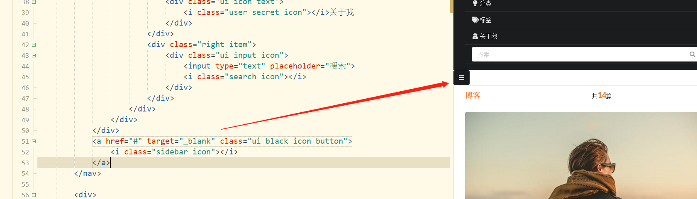
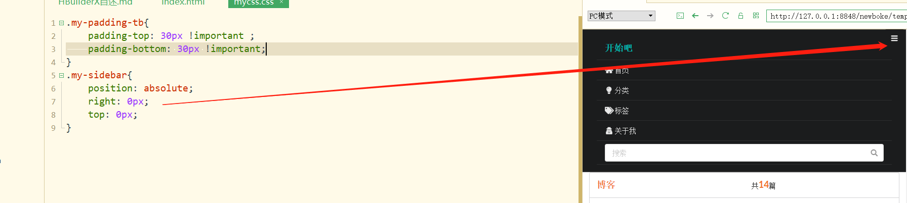
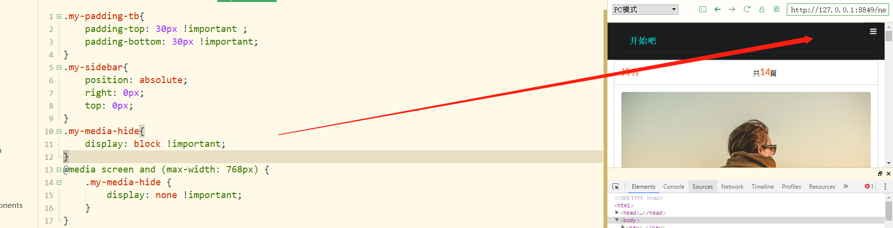

```java
<a href="#" target="_blank" class="ui black icon button">
				<i class="sidebar icon"></i>
</a>
```



```java
.my-sidebar{
	position: absolute;
	right: 0px;
	top: 0px;
}
```



```java
.my-sidebar{
		display: none !important;
}
@media screen and (max-width: 768px) {
	.my-media-hide {
		display: none !important;
	}
	.my-sidebar{
		display: block !important;
	}
}
```

隐藏的时候如果不可以一起隐藏可以一个个的隐藏

如果时a标签记得取消默认的点击行为

```java
$('.my-sidebar').click(function(){
			$('.my-menu-item').toggleClass("my-media-hide");
})
```

