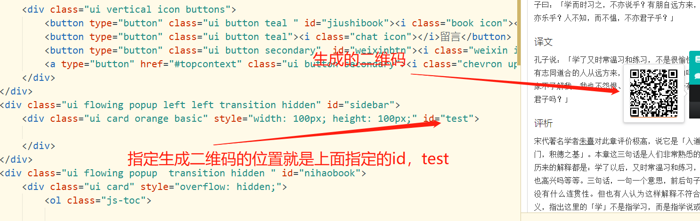
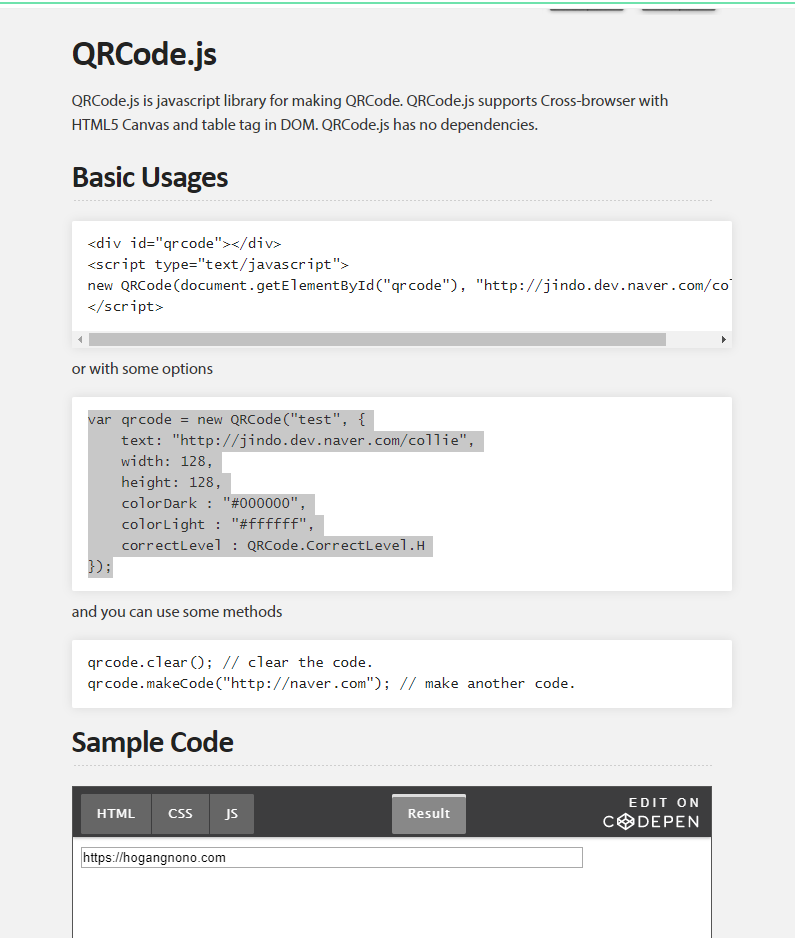

https://davidshimjs.github.io/qrcodejs/


下面是官网的列子test是生成二维码所在的id，就是在哪里生成二维码

```css
var qrcode = new QRCode("test", {
    text: "http://jindo.dev.naver.com/collie",
    width: 128,
    height: 128,
    colorDark : "#000000",
    colorLight : "#ffffff",
    correctLevel : QRCode.CorrectLevel.H
});
```



